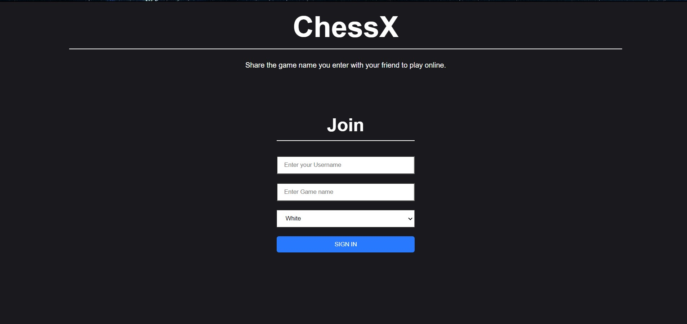
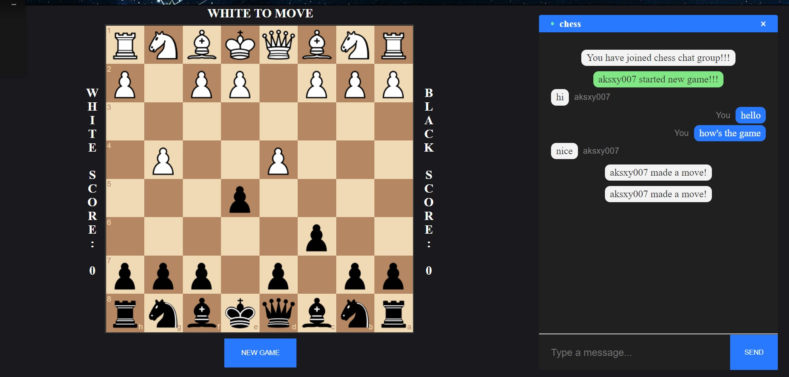

## ChessX
A web-based Multiplayer-Chess application called **chessX** is created using socket.io.
The appliction has real-time chat.

### Few Screenshots




To start the game start server by command<br>
```js
cd server
nodemon index.js
```

Now start the game by opening client/public/index.js for both players.<br>
If anyone wants to play with their friend share the room name with them 


### Developers
- [Atul Kumar Singh - 191IT106](https://github.com/aksxy007)
- [Kunal Singh Lohiya - 191IT128](https://github.com/kunalsingh2000)
- [Mohit Awachar - 191IT231](https://github.com/rgbstroke21)
- [Mihir Maheshwari - 191IT129](https://github.com/Mihir3101)
